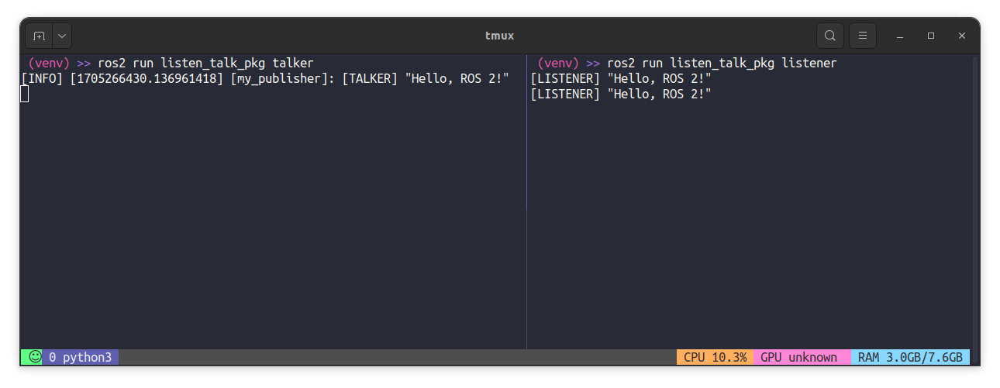

To run the `listener` node, we type
```bash
ros2 run listen_talk_pkg listener
```
If we let the `talker` node publish to the topic `listen_talk`:
```bash
ros2 run listen_talk_pkg talker
```
we get the results in the preview below.

